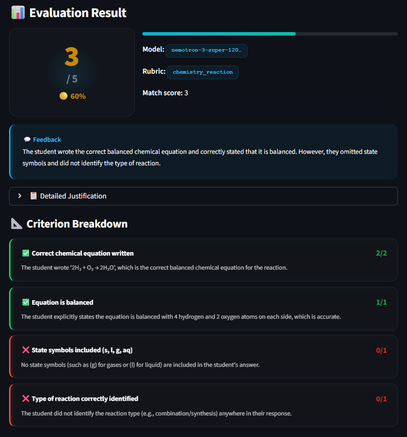

<h1 align="center">🎯 Rubric-Grounded AI Answer Evaluation System</h1>

<p align="center">
  <i>"Because every answer deserves fair, consistent, and transparent grading."</i>
</p>

<p align="center">
  <a href="https://rubric-ai-evaluator.streamlit.app/">
    
  </a>
</p>

<p align="center">
  
  
  
  
</p>

<p align="center">
  An AI-powered answer evaluation system that uses <b>structured rubrics</b> to grade student answers —<br/>ensuring consistency, fairness, and transparency that free-form AI grading cannot provide.
</p>

---

<h3 align="center">📸 See It In Action</h3>

<p align="center">
  
</p>

---

## 🧠 The Problem

Traditional AI grading (ChatGPT, Gemini, etc.) evaluates answers using **general knowledge** — leading to:
- ❌ **Inconsistent scores** — same answer, different marks each time
- ❌ **No transparency** — "Why did I get 3/5?" has no clear answer
- ❌ **Subject mismatch** — a Physics answer graded like an English essay

## ✅ The Solution

This system **retrieves the right rubric first**, then **grounds the AI evaluation** in specific, measurable criteria:

```
Question → Rubric Retrieval → LLM Evaluation (with rubric) → Structured Score
```

The result: **fair, explainable, criterion-by-criterion grading** — every time.

---

## 🏗️ Architecture

```
┌─────────────────────────────────────────────────────┐
│                    Streamlit UI                      │
│              (app.py — 870+ lines)                   │
├─────────────────────────────────────────────────────┤
│                                                      │
│  ┌──────────────┐    ┌──────────────────────────┐   │
│  │   Question    │───▶│   Rubric Retriever       │   │
│  │   + Answer    │    │   (retriever.py)         │   │
│  └──────────────┘    │                          │   │
│                       │  • Keyword tokenization  │   │
│                       │  • Stop-word filtering   │   │
│                       │  • Set intersection      │   │
│                       │  • Threshold fallback    │   │
│                       └───────────┬──────────────┘   │
│                                   │                   │
│                          Best-match rubric            │
│                                   │                   │
│                       ┌───────────▼──────────────┐   │
│                       │   LLM Evaluator          │   │
│                       │   (evaluator.py)         │   │
│                       │                          │   │
│                       │  • Structured prompt     │   │
│                       │  • JSON schema enforce   │   │
│                       │  • Arithmetic validation │   │
│                       │  • Model fallback        │   │
│                       └───────────┬──────────────┘   │
│                                   │                   │
│                          Structured JSON              │
│                                   │                   │
│                       ┌───────────▼──────────────┐   │
│                       │   Pydantic Validation    │   │
│                       │   (models.py)            │   │
│                       │                          │   │
│                       │  • Type safety           │   │
│                       │  • Marks clamping        │   │
│                       │  • Arithmetic correction │   │
│                       └──────────────────────────┘   │
│                                                      │
├─────────────────────────────────────────────────────┤
│               rubric_store.py (13 rubrics)           │
│               config.py (API + model settings)       │
└─────────────────────────────────────────────────────┘
```

---

## 📁 Project Structure

```
rubric-ai-evaluator/
│
├── app.py              # Streamlit UI — input form, score display, comparison mode
├── config.py           # API keys, model selection, evaluation parameters
├── evaluator.py        # LLM evaluation engine — prompt building, API calls, validation
├── models.py           # Pydantic data contracts — input/output type safety
├── retriever.py        # Keyword-based rubric retrieval with stop-word filtering
├── rubric_store.py     # 13 CBSE-style rubrics across 6 subjects
├── requirements.txt    # Python dependencies
├── .env.example        # API key template
└── .gitignore          # Ignores .env, venv, __pycache__
```

---

## 🔍 My Approach

### 1. Rubric Retrieval — Keyword Matching

I chose **keyword-based set intersection** over embeddings because:
- The assignment explicitly allows it
- For 13 rubrics, it's 100% accurate (verified with test cases)
- It's fast, predictable, and easy to debug

**How it works:**
```python
Question: "Define Newton's Second Law of Motion"
    ↓ normalize + remove stop words
Tokens: {"define", "newtons", "second", "law", "motion"}
    ↓ match against each rubric's keywords
Best match: physics_definition (score: 4)
```

**Key design decisions:**
- **Stop-word filtering** — removes "what", "is", "the" etc. that would cause false matches
- **Threshold system** — if no rubric scores ≥ 1, the fallback rubric activates
- **Fallback rubric** — handles unexpected subjects with generic criteria (relevance, clarity, structure)

### 2. LLM Evaluation — Controlled Prompting

The prompt is the most critical part. I engineered it to prevent common LLM grading failures:

**System Prompt (6 strict rules):**
```
1. Evaluate ONLY against the rubric — no outside criteria
2. Do NOT award marks for points not in the rubric
3. Do NOT penalize minor spelling errors
4. Evaluate each criterion INDEPENDENTLY
5. Be consistent — same quality = same marks
6. Respond ONLY with valid JSON
```

**Evaluation Prompt Structure:**
```
[QUESTION]        → What was asked
[STUDENT ANSWER]  → What the student wrote
[RUBRIC]          → Numbered criteria with marks
[ANCHOR EXAMPLES] → Good/poor answer examples (calibration)
[OUTPUT SCHEMA]   → Exact JSON structure required
```

**Why this works:**
- **Criterion independence** — prevents "halo effect" where one bad criterion tanks everything
- **Anchor examples** — calibrates the LLM's scoring scale
- **Strict JSON schema** — prevents free-text responses that can't be parsed
- **Arithmetic validation** — catches and fixes LLM math errors (~15% of responses)

### 3. Accuracy Guards

LLMs are great at reasoning but surprisingly bad at arithmetic. I added three layers of protection:

| Guard | What it catches | How |
|-------|----------------|-----|
| **JSON Cleaning** | `<think>` blocks, markdown fences | Regex stripping |
| **Arithmetic Fix** | Total ≠ sum of criteria | Recalculate from breakdown |
| **Marks Clamping** | Marks > max_marks | `min(awarded, max)` |

---

## 📊 Rubrics Implemented

| Subject | Rubric ID | Question Type | Marks |
|---------|-----------|---------------|-------|
| 🔬 Physics | `physics_definition` | Definition | 5 |
| 🔬 Physics | `physics_derivation` | Derivation | 5 |
| 🔬 Physics | `physics_numerical` | Numerical | 5 |
| 📐 Math | `math_equation` | Equation Solving | 5 |
| 📐 Math | `math_proof` | Proof/Theorem | 5 |
| 📝 English | `english_essay` | Essay Writing | 5 |
| 📝 English | `english_comprehension` | Comprehension | 5 |
| 🧪 Chemistry | `chemistry_reaction` | Chemical Reaction | 5 |
| 🧪 Chemistry | `chemistry_definition` | Definition | 5 |
| 🧬 Biology | `biology_process` | Process Explanation | 5 |
| 🧬 Biology | `biology_definition` | Definition | 5 |
| 📜 Social Science | `social_science_explain` | Explanation | 5 |
| 🔄 General | `fallback_generic` | Any (Fallback) | 5 |

Each rubric includes **keywords**, **criteria with marks**, and **anchor examples** for LLM calibration.

---

## ⚖️ Bonus: Rubric vs No-Rubric Comparison

The comparison mode runs **two parallel evaluations** and shows why rubric-grounded grading is superior:

| Aspect | With Rubric | Without Rubric |
|--------|-------------|----------------|
| **Consistency** | ✅ Same answer → same score | ❌ Variable scores |
| **Transparency** | ✅ Per-criterion breakdown | ❌ Single opaque score |
| **Fairness** | ✅ Objective criteria | ❌ LLM's subjective judgment |
| **Leniency** | ✅ Controlled by rubric | ❌ Often over-generous |

---

## 🚀 Quick Start

### Prerequisites
- Python 3.9+
- An API key (free tier available)

### Setup

```bash
# 1. Clone the repository
git clone https://github.com/Abhichy18/rubric-ai-evaluator.git
cd rubric-ai-evaluator

# 2. Create virtual environment
python -m venv venv
source venv/bin/activate        # Linux/Mac
venv\Scripts\activate           # Windows

# 3. Install dependencies
pip install -r requirements.txt

# 4. Set up API key
cp .env.example .env
# Edit .env and add your API key

# 5. Run the app
streamlit run app.py
```

The app will open at `http://localhost:8501`

---

## 🔮 Future Improvements

If I had more time, here's what I'd add:

| Improvement | Why |
|-------------|-----|
| **TF-IDF weighted keywords** | Better retrieval accuracy for ambiguous questions |
| **Embedding-based retrieval** | Scale beyond keyword matching for 100+ rubrics |
| **Rubric editor UI** | Let teachers create/edit rubrics without touching code |
| **Batch evaluation** | Upload CSV of answers, get scores for entire class |
| **Score history** | Track student performance over time |
| **Multi-language** | Support Hindi and regional language answers |
| **Confidence scoring** | Show how confident the AI is in each criterion score |
| **Formal logging** | Production-level error tracking with structured logs |

---

## 🛠️ Tech Stack

| Component | Technology | Why |
|-----------|-----------|-----|
| **Frontend** | Streamlit | Rapid prototyping, built-in components |
| **LLM API** | NVIDIA NIM | High-performance access to top-tier models |
| **Validation** | Pydantic V2 | Type safety, automatic error correction |
| **HTTP** | Requests | Simple, reliable API calls |
| **Config** | python-dotenv | Secure API key management |

---

<p align="center">
  <b>Built for Evalvia AI Internship</b>
  <br/>
  <sub>Made with ❤️ by Abhishek Choudhary</sub>
</p>
